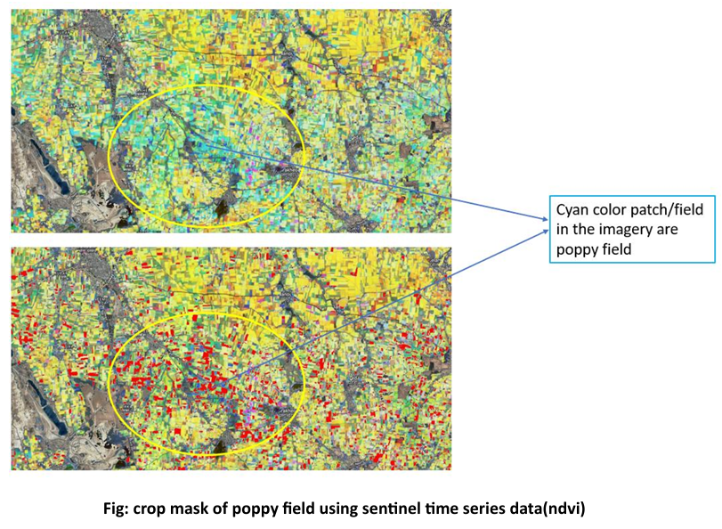
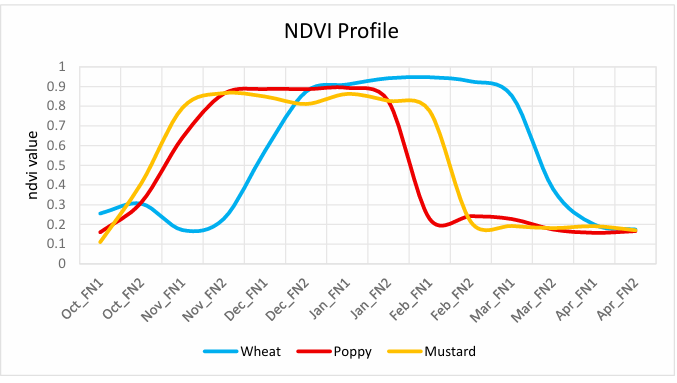
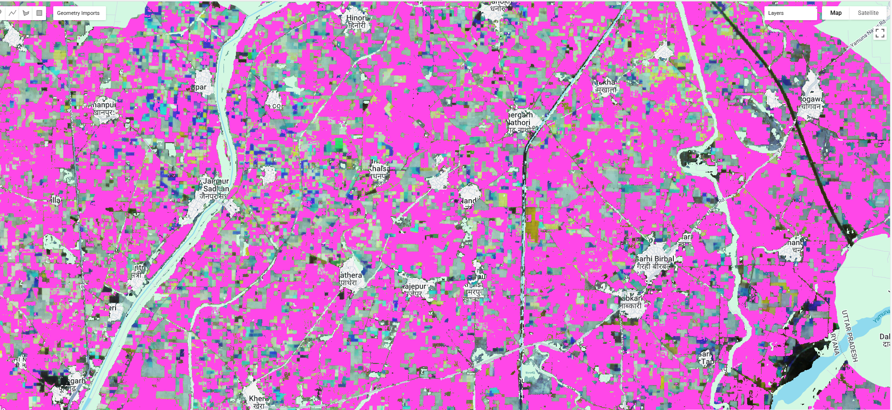

# 🌾 Crop Classification and Monitoring

**Description:**  
This project classifies crops using **Sentinel-2 MSI data** , **Sentinel-1 SAR** and multi-temporal vegetation indices (NDVI, EVI, SAVI, NDMI, RVI). The workflow includes crop classification using Random Forest, crop area estimation, validation with ground truth, and temporal NDVI analysis.

---

🌐 **Visualizations** 

Here’s the snaps of classiification 👇  

 ---

## ✨ Key Features
- Multi-temporal NDVI & EVI stacking 
- Random Forest crop classification  
- Crop area calculation and CSV export  
- Temporal NDVI charts for validation  
- Non-crop masking for refined classification  

---

## 🛠️ Tech Stack
- **Google Earth Engine (JavaScript API)** – satellite data processing  
- **Sentinel-2 MSI** – optical imagery  
- **ESA WorldCover** – agriculture mask  
- **Indices:** NDVI, EVI, NDMI, RGVI  
- **Classifier:** Random Forest  
- **Outputs:** CSV, classified map, area statistics, validation charts  

---

## 📌 Use Cases
- Crop monitoring & mapping  
- Crop area estimation for agriculture planning  
- Temporal vegetation health analysis  
- Validation of classification using ground truth points  

---

## 📸 Demo / Visualization
Add screenshots or GIFs of your GEE outputs in `assets/` folder. Example:

---

## 📊 Output
- **Classified crop maps** (`classifed image`)  
- **Crop area statistics** in hectares  
- **Validation metrics** (confusion matrix & accuracy)  
- **Temporal NDVI charts** for different crop classes  
- **Exportable CSV files** for further analysis  

---

## 📂 Files
- `crop_classification.js` – Google Earth Engine script  
- `assets/` – screenshots, GIFs, charts  

---

## 📄 License
This project is licensed under the **MIT License**. See [LICENSE](../LICENSE) for details.

---

## 👤 Author
**Atul Bhardwaj**  
_Last updated: September 2025_

---

