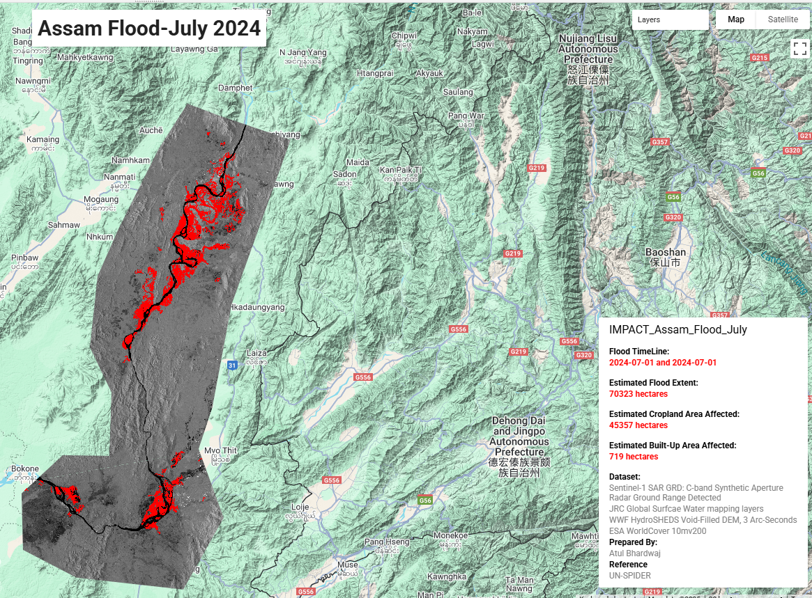

# Sentinel-1 Flood Inundation Mapping Dashboard

Monitor and visualize flood extent, cropland, and built-up area impacts using Sentinel-1 SAR data in Google Earth Engine (GEE).

---

🌐 **Live Demo**: [Click here to explore](https://atulmncfc.users.earthengine.app/view/flood-mapping)

Here’s the app in action 👇  

 ---

## 📌 Project Overview

This project leverages **Sentinel-1 SAR (C-band)** imagery and other geospatial datasets to detect floods and assess their impacts. The workflow:

- Creates **before-and-after flood mosaics**  
- Applies **slope filtering** and **connected pixel elimination** to refine flood extent  
- Calculates affected **cropland** and **built-up areas**  
- Generates an **interactive UI panel** for summary metrics  
- Exports results to **Google Drive** for further analysis  

---

## 🛰️ Data Used

- **Sentinel-1 GRD (COPERNICUS/S1_GRD)** – C-band SAR imagery, VH polarization  
- **JRC Global Surface Water** – Permanent water bodies  
- **WWF HydroSHEDS DEM** – Terrain and slope masking  
- **ESA WorldCover v200** – Land cover information  

---

## 🛠️ Tech Stack

- **Google Earth Engine (JavaScript API)**  
- SAR processing: mosaicking, median filtering, ratio computation  
- Flood mapping: thresholding, masking, connected pixel filtering  
- Impact assessment: cropland and built-up area calculation  
- UI Dashboard: GEE `ui.Panel` for displaying metrics  

---

## 📊 Features & Workflow

### 1️⃣ Flood Detection
- Compute ratio of **after / before flood SAR backscatter**  
- Threshold ratio > 1.25 → flood candidate pixels  
- Mask out **permanent water** and **steep slopes**  

### 2️⃣ Flood Refinement
- Eliminate **isolated pixels** using connected pixel thresholding  
- Apply **slope mask** (pixels < 5°)  

### 3️⃣ Impact Assessment
- Intersect refined flood extent with **land cover**  
- Compute **flooded cropland** and **built-up areas** in hectares  

### 4️⃣ Interactive Dashboard
- Displays key statistics:
  - Flood timeline  
  - Estimated flood extent (ha)  
  - Flooded cropland (ha)  
  - Flooded built-up area (ha)  
- Lists datasets and project authorship  

---

## 📂 Exports / Outputs

- **Flood extent raster** (`Flood Extent`)  
- **Cropland & built-up impact maps**  
- **Summary metrics** available via **UI panel**  

---

## 💡 Use Cases

- Regional flood monitoring  
- Disaster management and planning  
- Agricultural impact assessment  
- Flood risk mapping and mitigation planning  

---

## 👤 Author

**Atul Bhardwaj**  
Remote Sensing & GIS Specialist  
GitHub: [https://github.com/gisatb](https://github.com/gisatb)
