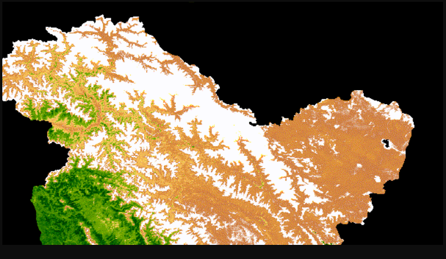

# MODIS NDVI Time-Series Animation (2015–2020)

Generate NDVI-based seasonal cycle animations using MODIS (MOD13Q1) data in Google Earth Engine (GEE).  

---

🌐 **Live Demo**: [Click here to explore](https://atulmncfc.users.earthengine.app/view/ndvi-analysis)

Here’s the app in action 👇  



 ---
## 📌 Project Overview

This project creates a **time-series NDVI GIF animation** to visualize vegetation dynamics across the study region. The workflow:

- Uses **MODIS MOD13Q1 NDVI (250m, 16-day composite)**  
- Builds a **median composite for each day-of-year (DOY)** across multiple years  
- Produces a **smoothed seasonal NDVI cycle**  
- Creates an **animated GIF** showing vegetation greenness changes  

---

## 🛰️ Data Used

- **MODIS/006/MOD13Q1** – 16-day NDVI composite at 250m resolution  

---

## 🛠️ Tech Stack

- **Google Earth Engine (JavaScript API)**  
- Temporal compositing & day-of-year (DOY) matching  
- Median reduction to smooth seasonal cycles  
- GIF generation using `getVideoThumbURL` and `ui.Thumbnail`  

---

## 📊 Workflow

1️⃣ **Study Area**  
Define a polygon or import shapefile (e.g., HKH region).  

2️⃣ **MODIS NDVI Processing**  
- Load MOD13Q1 NDVI collection  
- Add **day-of-year (DOY)** property  
- Group images by DOY across years  
- Apply **median composite**  

3️⃣ **Visualization**  
- NDVI color palette: white → green gradient  
- Create RGB visualization frames  
- Generate **GIF animation**  

4️⃣ **Output**  
- Print GIF URL (`getVideoThumbURL`)  
- Render GIF inline using `ui.Thumbnail`  

---

## 🎨 Visualization Parameters

```js
var visParams = {
  min: 0.0,
  max: 9000.0,
  palette: [
    'FFFFFF', 'CE7E45', 'DF923D', 'F1B555', 'FCD163',
    '99B718', '74A901', '66A000', '529400',
    '3E8601', '207401', '056201', '004C00',
    '023B01', '012E01', '011D01', '011301'
  ],
};

---

## 📂 Exports / Outputs

- NDVI GIF animation (2015–2020)

- Seasonal NDVI visualization for study area

---

## 💡 Use Cases

- **Vegetation dynamics** monitoring

- Crop phenology visualization

- Ecosystem seasonal cycle analysis

- **Climate & vegetation change** studies

---

##👤 Author

**Atul Bhardwaj**
Remote Sensing & GIS Specialist
GitHub: https://github.com/gisatb